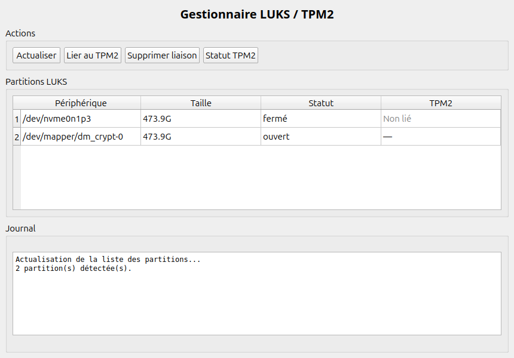

# UbuntuTPM2Disk


Outil graphique et CLI pour Ubuntu permettant de déverrouiller automatiquement les
partitions **LUKS** au démarrage via le module **TPM2** — sans mot de passe, sans
fichier clé stocké en clair sur le disque.



---

## Comment ça fonctionne

La clé LUKS est **scellée dans le TPM2** et liée à des registres PCR (Platform
Configuration Registers). À chaque démarrage, si la configuration du système correspond
aux valeurs PCR enregistrées (Secure Boot actif, firmware inchangé…), le TPM2 libère
automatiquement la clé. En cas de modification suspecte, le mot de passe LUKS reste
requis.

```
Démarrage → initramfs → TPM2 vérifie les PCR → libère la clé → partition déchiffrée
```

**Backends supportés :**

| Backend | Paquet | Recommandé |
|---------|--------|------------|
| `clevis-tpm2` | `clevis-luks clevis-tpm2 clevis-initramfs` | Oui |
| `systemd-cryptenroll` | inclus dans `systemd` (≥ 248) | Ubuntu 22.04+ |

---

## Prérequis

- Ubuntu 20.04 ou supérieur
- TPM2 activé dans le BIOS/UEFI (`/dev/tpm0` ou `/dev/tpmrm0` présent)
- Secure Boot recommandé (PCR 7)

Vérifier la présence du TPM2 :

```bash
ls /dev/tpm*
```

---

## Installation

### Via le paquet .deb

```bash
# Télécharger la dernière release puis :
sudo dpkg -i ubuntu-tpm2disk_1.0.0_all.deb
sudo apt-get install -f          # installe les dépendances manquantes
```

### Depuis les sources

```bash
https://github.com/MentalDeFeur/UbuntuCryptDisk.git
cd UbuntuCryptDisk

# Dépendances (backend clevis)
sudo apt install tpm2-tools cryptsetup python3-pyqt5 \
                 clevis-luks clevis-tpm2 clevis-initramfs

# Ou avec systemd-cryptenroll (Ubuntu 22.04+)
sudo apt install tpm2-tools cryptsetup python3-pyqt5

# Construire le .deb
bash build_deb.sh
sudo dpkg -i ubuntu-tpm2disk_1.0.0_all.deb
```

---

## Utilisation

### Interface graphique

```bash
sudo ubuntu-tpm2disk-gui
```

### Ligne de commande

```bash
# Lister les partitions LUKS et leur statut TPM2
sudo ubuntu-tpm2disk list

# Lier une partition au TPM2 (PCR 7 = Secure Boot, recommandé)
sudo ubuntu-tpm2disk bind /dev/sda5

# Lier avec plusieurs PCR
sudo ubuntu-tpm2disk bind /dev/sda5 --pcr 0,1,7

# Supprimer la liaison TPM2
sudo ubuntu-tpm2disk unbind /dev/sda5

# Statut TPM2 et valeurs PCR actuelles
sudo ubuntu-tpm2disk status

# Vérifier les dépendances
sudo ubuntu-tpm2disk check

# Menu interactif
sudo ubuntu-tpm2disk
```

---

## Choix des PCR

| PCR | Contenu | Conseil |
|-----|---------|---------|
| 0 | Firmware UEFI | Éviter — change à chaque MAJ BIOS |
| 1 | Configuration firmware | Éviter |
| 2 | Code ROM option | Éviter |
| 4 | Bootloader (GRUB) | Avec précaution |
| **7** | **État Secure Boot** | **Recommandé (défaut)** |
| 11 | Unified Kernel Image | Bon avec systemd-cryptenroll |

> Utiliser PCR 7 seul offre le meilleur compromis : la clé est protégée contre le
> démarrage sur un système non signé, mais reste accessible après une mise à jour du
> noyau ou du BIOS.

---

## Configuration manuelle (sans l'outil)

<details>
<summary>Étapes détaillées</summary>

### 1. Vérifier le TPM2

```bash
ls /dev/tpm*
sudo tpm2_pcrread sha256:0,1,2,3,4,5,6,7
```

### 2a. Liaison via clevis-tpm2

```bash
sudo apt install clevis-luks clevis-tpm2 clevis-initramfs

# Lier (demande le mot de passe LUKS actuel)
sudo clevis luks bind -d /dev/sda5 tpm2 '{"pcr_ids":"7"}'

# Vérifier
sudo clevis luks list -d /dev/sda5
```

### 2b. Liaison via systemd-cryptenroll

```bash
sudo systemd-cryptenroll --tpm2-device=auto --tpm2-pcrs=7 /dev/sda5
```

### 3. Configurer /etc/crypttab

```bash
# clevis
echo "luks_sda5 /dev/sda5 none luks,discard,clevis" | sudo tee -a /etc/crypttab

# systemd-cryptenroll
echo "luks_sda5 /dev/sda5 none luks,discard,tpm2-device=auto" | sudo tee -a /etc/crypttab
```

### 4. Régénérer l'initramfs

```bash
sudo update-initramfs -u -k all
```

</details>

---

## Dépannage

### La partition ne se déverrouille pas au démarrage

```bash
# Vérifier la liaison
sudo clevis luks list -d /dev/sda5          # clevis
sudo systemd-cryptenroll /dev/sda5          # systemd-cryptenroll

# Tester manuellement
sudo clevis luks unlock -d /dev/sda5

# Vérifier les PCR actuels
sudo tpm2_pcrread sha256:7

# Régénérer l'initramfs
sudo update-initramfs -u -k all
```

### Les PCR ont changé (MAJ BIOS ou Secure Boot modifié)

```bash
sudo ubuntu-tpm2disk unbind /dev/sda5
sudo ubuntu-tpm2disk bind /dev/sda5
```

### Le mot de passe d'urgence

La liaison TPM2 occupe un slot LUKS supplémentaire. **Le mot de passe LUKS d'origine
reste toujours valide** comme solution de secours.

---

## Sécurité

- Aucun fichier clé stocké en clair sur le disque
- La clé est liée à l'état matériel du système via les PCR
- Une modification du firmware, de Secure Boot ou du bootloader bloque l'accès automatique
- Résistant au vol du disque seul (la clé reste dans le TPM2 de la machine)

---

## Structure du projet

```
UbuntuCryptDisk/
├── ubuntu_tpm2disk.py       # CLI — list, bind, unbind, status, check
├── ubuntu_tpm2disk_gui.py   # Interface graphique PyQt5
├── build_deb.sh             # Construction du paquet .deb
├── debian/                  # Métadonnées Debian
│   ├── control
│   ├── changelog
│   ├── copyright
│   ├── postinst
│   └── prerm
└── docs/
    └── screenshot.png
```

---

## Licence

MIT — voir [debian/copyright](debian/copyright)
